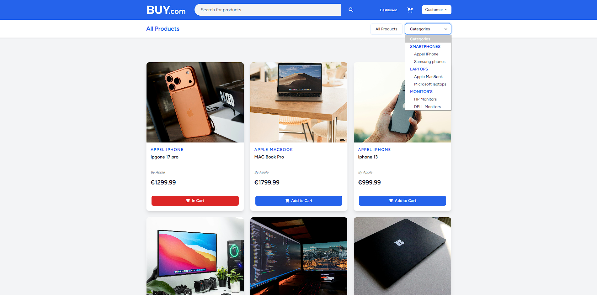
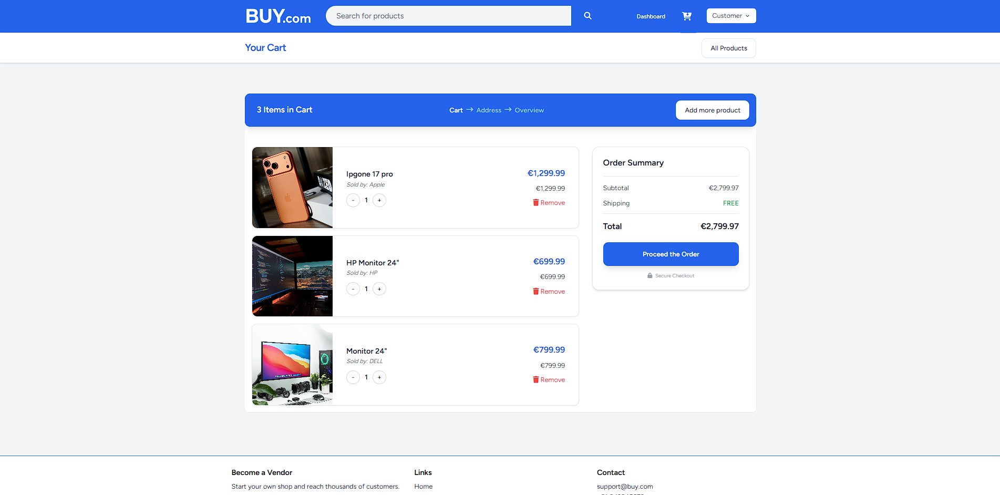
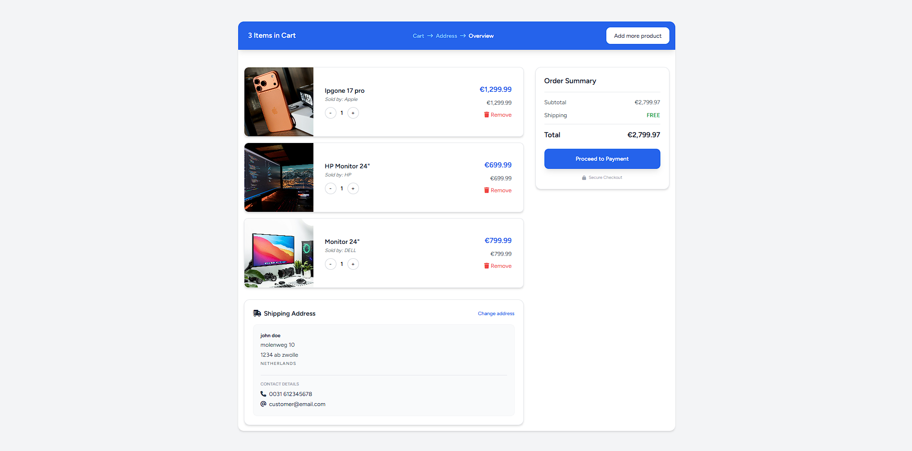
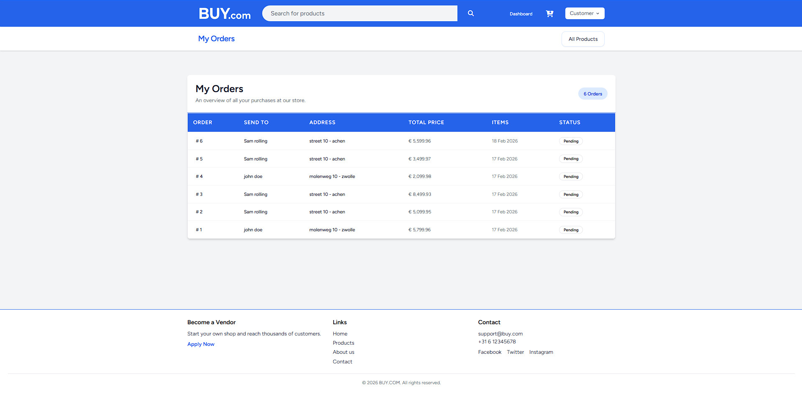
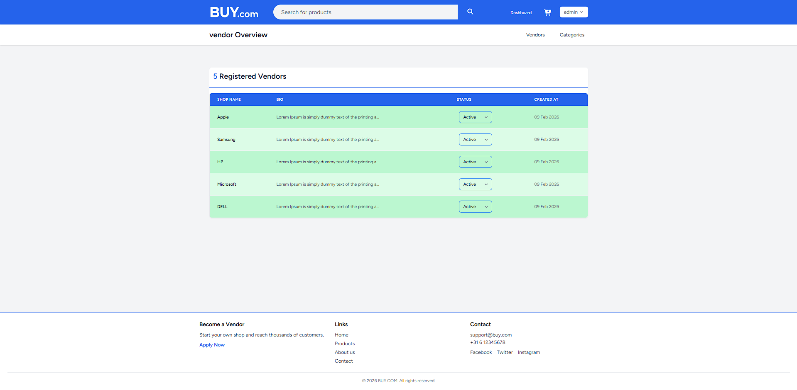
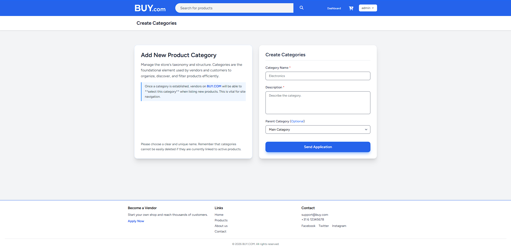

# BuyCom — Full-Stack E-Commerce Solution

<p align="center">
  
</p>

<p align="center">
  
  
  
</p>

---

## 🚀 Project Overview

**BuyCom** is a full-stack e-commerce platform built with **Laravel 11**. It includes a dynamic product catalog, a persistent shopping cart, a multi-step checkout flow and an admin dashboard for vendor/category management.

### Why this project

This project was built to bridge basic CRUD examples and production-style applications. Highlights include:

- **Relational database design** for cart → order transitions
- **Performance-conscious data loading** (eager loading where appropriate)
- **Server-side validation and authorization** via Laravel Policies & Gates

---

## 📸 Visual Overview

(screenshots in `docs/screenshots/`)

<table border="0">
  <tr>
    <td width="50%">
      <p align="center"><b>Product Catalog</b></p>
      
    </td>
    <td width="50%">
      <p align="center"><b>Shopping Cart</b></p>
      
    </td>
  </tr>
  <tr>
    <td width="50%">
      <p align="center"><b>Multi-Step Checkout</b></p>
      
    </td>
    <td width="50%">
      <p align="center"><b>Order Management</b></p>
      
    </td>
  </tr>
  <tr>
    <td width="50%">
      <p align="center"><b>Vendor Management (Admin)</b></p>
      
    </td>
    <td width="50%">
      <p align="center"><b>Category Administration</b></p>
      
    </td>
  </tr>
</table>

---

## ✨ Key Features

- **Dynamic Catalog:** Product listing with stock and vendor info
- **Persistent Cart:** Retains items between sessions
- **Multi-Step Checkout:** Cart → Address → Overview
- **Order Tracking:** Status badges and history per user
- **Admin Dashboard:** Vendor & category management
- **Mobile-First UI:** Built with Tailwind CSS

---

## 🛠️ Tech Stack

- **Backend:** Laravel 11 (PHP)
- **Frontend:** Blade, Tailwind CSS, FontAwesome 6
- **Database:** MySQL
- **Tools:** Vite, Composer, NPM

---

## ✅ Requirements

- PHP 8.1+ (check `composer.json` for exact constraint)
- Composer
- Node.js 16+ and NPM (or Yarn)
- MySQL 5.7 / 8.x or compatible

---

## 🔧 Local Setup & Installation

1. Clone the repository and enter the folder:

```bash
git clone https://github.com/yourusername/buycom.git
cd buycom
```

2. Install PHP and JS dependencies:

```bash
composer install
npm install
```

3. Environment configuration:

```bash
cp .env.example .env
php artisan key:generate
```

Update the following `.env` values to match your database and mail settings:

```env
DB_CONNECTION=mysql
DB_HOST=127.0.0.1
DB_PORT=3306
DB_DATABASE=buycom
DB_USERNAME=root
DB_PASSWORD=

MAIL_MAILER=smtp
MAIL_HOST=mailhog
MAIL_PORT=1025
```

4. Database migrations & seeders:

```bash
php artisan migrate --seed
```

Check `database/seeders/DatabaseSeeder.php` for seeded sample data and example accounts.

5. Storage link (for public uploads) and asset build:

```bash
php artisan storage:link
npm run dev   # or `npm run build` for production
```

6. Run the application locally:

```bash
php artisan serve --host=127.0.0.1 --port=8000
# then visit http://127.0.0.1:8000
```

---

## 🔁 Running Tests

```bash
php artisan test
# or
vendor/bin/phpunit
```

---

## ℹ️ Usage / Demo

- Register or check the seeded user accounts (see seeders).
- Browse the catalog, add items to cart, and proceed through checkout.

---

## Contributing

Contributions welcome — please open issues or pull requests. Add tests for new features and follow PSR-12 coding style.

---

## License

This project does not include a license file. Add a `LICENSE` file (MIT, Apache-2.0, etc.) if you want to make the project open-source.

---

<p align="center">Developed as part of a Learning Journey in Modern Web Development.</p>
